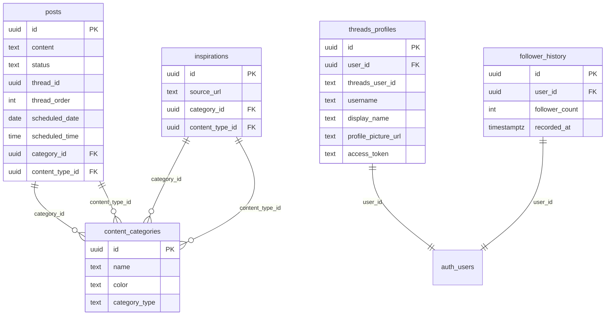

## Overview

Threadflow uses Supabase PostgreSQL with Row Level Security (RLS) enabled on all tables. The database lives in Supabase project `xaoodbhmrkpcweedvoev`.

## Tables

### posts

The core content table. Stores all posts, whether draft, scheduled, or published.

| Column | Type | Description |
|--------|------|-------------|
| id | uuid (PK) | Auto-generated unique identifier |
| content | text | Post body text |
| status | text | One of: `draft`, `scheduled`, `published` |
| thread_id | uuid | Groups posts that belong to the same thread |
| thread_order | integer | Position within a thread (1-based) |
| scheduled_date | date | Date the post is scheduled for |
| scheduled_time | time | Time the post is scheduled for |
| category_id | uuid (FK) | References content_categories (pillar) |
| content_type_id | uuid (FK) | References content_categories (content type) |

<Callout kind="info">
  Thread posts share the same `thread_id` and are ordered by `thread_order`. A standalone post has `thread_order = null` or `1`.
</Callout>

### threads_profiles

Stores connected Threads account data and OAuth tokens. One row per user.

| Column | Type | Description |
|--------|------|-------------|
| id | uuid (PK) | Auto-generated unique identifier |
| user_id | uuid (FK) | References Supabase auth.users |
| threads_user_id | text | Threads platform user ID |
| username | text | Threads handle |
| display_name | text | Threads display name |
| profile_picture_url | text | Avatar URL from Threads |
| access_token | text | Encrypted long-lived OAuth token |

<Callout kind="danger">
  The `access_token` column contains encrypted OAuth tokens. Never expose this column in client-side queries. RLS policies restrict access to the token owner only.
</Callout>

### content_categories

Dual-purpose category table used for both content pillars and content types.

| Column | Type | Description |
|--------|------|-------------|
| id | uuid (PK) | Auto-generated unique identifier |
| name | text | Category display name |
| color | text | Hex color code for UI display |
| category_type | text | Either `pillar` or `content_type` |

The `category_type` field distinguishes between:
- **pillar**: Content themes (e.g., "Education", "Behind the Scenes")
- **content_type**: Format types (e.g., "Thread", "Single Post", "Poll")

### inspirations

Saved content inspiration with optional source URL and categorization.

| Column | Type | Description |
|--------|------|-------------|
| id | uuid (PK) | Auto-generated unique identifier |
| source_url | text | URL where the inspiration was found |
| category_id | uuid (FK) | References content_categories (pillar) |
| content_type_id | uuid (FK) | References content_categories (content type) |

### voice_of_customer

Stores customer language, feedback, and quotes for AI content generation context.

| Column | Type | Description |
|--------|------|-------------|
| id | uuid (PK) | Auto-generated unique identifier |
| customer_name | text | Name or identifier of the customer |
| content | text | The actual quote, feedback, or language |
| source | text | Where this was collected (e.g., "DM", "Survey", "Call") |
| tags | text[] | Array of tags for filtering |

### style_guides

User-defined writing style references that inform AI content generation.

| Column | Type | Description |
|--------|------|-------------|
| id | uuid (PK) | Auto-generated unique identifier |
| title | text | Style guide name |
| content | text | Style rules and examples |
| category | text | Grouping category |

### content_uploads

Uploaded or imported content used as source material for AI repurposing.

| Column | Type | Description |
|--------|------|-------------|
| id | uuid (PK) | Auto-generated unique identifier |
| title | text | Content title |
| content | text | Full content body |
| source_url | text | Original URL if imported from web |

### threads_webhook_events

Stores incoming webhook events from the Threads platform.

| Column | Type | Description |
|--------|------|-------------|
| id | uuid (PK) | Auto-generated unique identifier |
| event_type | text | Type of event (e.g., `mentions`, `publish`) |
| threads_user_id | text | Threads user the event relates to |
| object_id | text | Threads object ID (post, comment, etc.) |
| payload | jsonb | Full event payload from Threads |
| processed | boolean | Whether the event has been handled |

### follower_history

Daily snapshots of follower counts, populated by the `sync-followers` cron job.

| Column | Type | Description |
|--------|------|-------------|
| id | uuid (PK) | Auto-generated unique identifier |
| user_id | uuid (FK) | References Supabase auth.users |
| follower_count | integer | Follower count at time of recording |
| recorded_at | timestamptz | When this snapshot was taken |

## Row Level Security

All tables have RLS enabled. Users can only read and write their own data. The `admin-dashboard` function bypasses RLS using the service role key for aggregate stats.

See [Security Overview](/security/overview) for details on RLS policies and access control.
