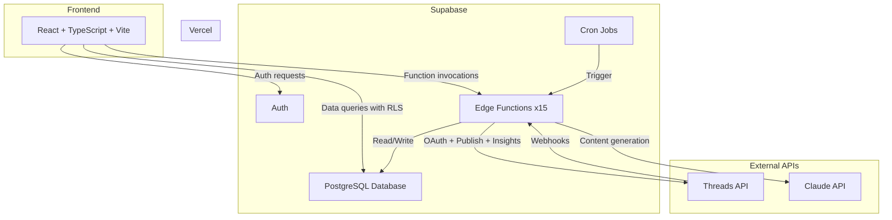
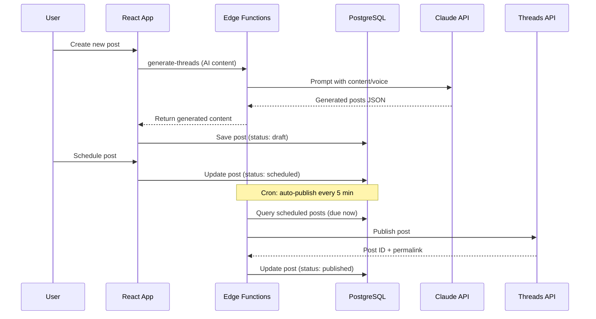
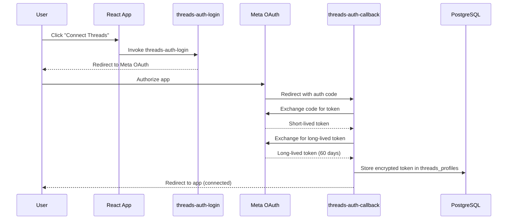

## Tech stack

| Layer | Technology | Purpose |
|-------|-----------|---------|
| Frontend | React + TypeScript + Vite | SPA with component-based UI |
| Backend | Supabase | Auth, PostgreSQL database, Edge Functions, cron jobs |
| AI | Claude API (claude-3-haiku-20240307) | Content generation and hashtag suggestions |
| Social | Threads API | OAuth, publishing, insights, mentions, replies |
| Hosting | Vercel | Frontend deployment at threadly-planner.vercel.app |
| Supabase project | xaoodbhmrkpcweedvoev | All backend services |

## System architecture



## Data flow: content lifecycle

This diagram shows how a piece of content moves from creation to publishing.



## Data flow: Threads OAuth



## Edge Function categories

Threadflow has 15 Edge Functions organized into four groups:

| Category | Functions | Description |
|----------|-----------|-------------|
| Content generation | generate-threads, fetch-url-content | AI content creation and URL extraction |
| Threads integration | threads-auth-login, threads-auth-callback, threads-profile, threads-publish, threads-insights, threads-replies, threads-mentions, threads-disconnect, threads-webhook | Full Threads API integration |
| Automation | auto-publish, sync-followers | Cron-triggered background jobs |
| External | webhook-create-post, admin-dashboard | Incoming webhooks and admin stats |

See [Edge Functions Overview](/edge-functions/overview) for complete documentation of each function.

## Deployment

The frontend deploys to Vercel automatically on push to main. Edge Functions deploy via the Supabase CLI.

```bash
# Deploy a single edge function
supabase functions deploy generate-threads --no-verify-jwt

# Deploy all edge functions
supabase functions deploy --no-verify-jwt
```

<Callout kind="info">
  All edge functions are deployed with `--no-verify-jwt` because they handle authentication internally or are public-facing endpoints (OAuth callbacks, webhooks).
</Callout>

## Next steps

<Columns cols="2">
  <Card title="Database schema" href="/architecture/database" icon="database" horizontal="false">
    All tables, columns, and relationships documented.
  </Card>

  <Card title="Security overview" href="/security/overview" icon="shield" horizontal="false">
    RLS policies, secrets management, and access control.
  </Card>
</Columns>
