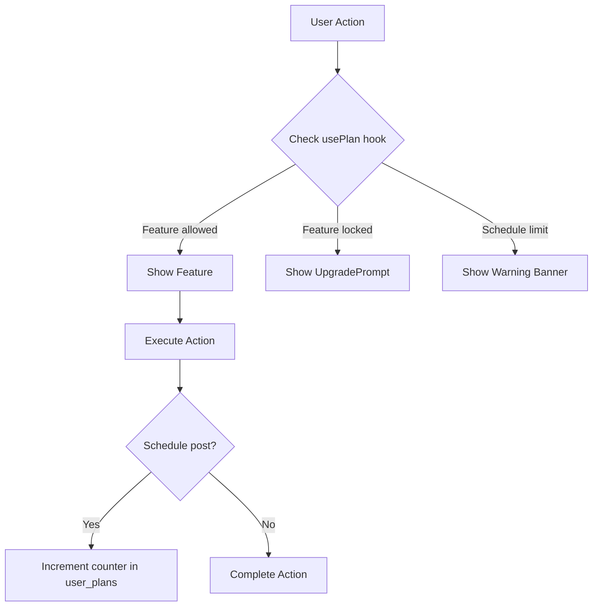

## Overview

Threadflow uses a plan-based gating system that controls access to features based on the user's subscription tier. The system is designed to be transparent: locked features are never hidden, they display an upgrade prompt instead.

## Architecture



## Frontend: usePlan Hook

The `usePlan` hook is the single source of truth for plan limits across the app.

```typescript title="src/hooks/usePlan.ts"
import { usePlan } from '@/hooks/usePlan';

export default function MyComponent() {
  const { plan, limits, canSchedule, scheduledPostsUsed } = usePlan();

  // Check specific feature access
  if (!limits.aiGeneration) {
    return <UpgradePrompt feature="AI Generation" />;
  }

  // Check schedule capacity
  if (!canSchedule) {
    return <p>Monthly limit reached</p>;
  }
}
```

### Return Values

| Property | Type | Description |
|----------|------|-------------|
| `plan` | `'free' \| 'pro' \| 'team'` | Current plan tier |
| `limits` | `PlanLimits` | Object with all feature flags and numeric limits |
| `scheduledPostsUsed` | `number` | Posts scheduled this month |
| `canSchedule` | `boolean` | Whether the user can schedule more posts |
| `loading` | `boolean` | Whether plan data is still loading |

### PlanLimits Object

| Property | Type | Free | Pro | Team |
|----------|------|------|-----|------|
| `scheduledPostsPerMonth` | `number` | 20 | Infinity | Infinity |
| `threadsAccounts` | `number` | 1 | 3 | 10 |
| `teamMembers` | `number` | 0 | 1 | 5 |
| `aiGeneration` | `boolean` | false | true | true |
| `voiceToText` | `boolean` | false | true | true |
| `urlRepurpose` | `boolean` | false | true | true |
| `templates` | `boolean` | false | true | true |
| `webhookAccess` | `boolean` | false | true | true |
| `mcpAccess` | `boolean` | false | true | true |
| `fullAnalytics` | `boolean` | false | true | true |
| `recommendations` | `boolean` | false | true | true |
| `bestTimeHeatmap` | `boolean` | false | true | true |
| `topPosts` | `boolean` | false | true | true |
| `adminDashboard` | `boolean` | false | false | true |

## Frontend: UpgradePrompt Component

A reusable component that displays a branded upgrade card wherever a feature is locked.

```typescript title="src/components/UpgradePrompt.tsx"
import { UpgradePrompt } from '@/components/UpgradePrompt';

// Basic usage
<UpgradePrompt feature="AI content repurposing" />

// Specify target plan
<UpgradePrompt feature="Admin dashboard" plan="Team" />
```

The component displays a crown icon, the feature name, and a direct link to the Billing page.

## Gated Pages

### Create Page

| Section | Gate | Free Behavior |
|---------|------|---------------|
| Templates row | `limits.templates` | Hidden |
| Schedule limit | `canSchedule` | Warning banner with usage count |
| Repurpose content | `limits.aiGeneration` | UpgradePrompt |
| Voice to threads | `limits.voiceToText` | UpgradePrompt |

### Analytics Page

| Section | Gate | Free Behavior |
|---------|------|---------------|
| Stats cards | Always shown | Displays real data |
| Views chart | `limits.fullAnalytics` | UpgradePrompt |
| Best time heatmap | `limits.bestTimeHeatmap` | Hidden |
| Recommendations | `limits.recommendations` | Hidden |
| Top posts | `limits.topPosts` | Hidden |

## Backend: user_plans Table

<Steps>
  <Step title="Auto-creation on signup" icon="user-plus" title-type="p">
    A database trigger creates a `user_plans` record with `plan: 'free'` whenever a new user signs up via Supabase Auth.

    ```sql
    create or replace function public.handle_new_user_plan()
    returns trigger as $$
    begin
      insert into public.user_plans (user_id, plan)
      values (new.id, 'free');
      return new;
    end;
    $$ language plpgsql security definer;
    ```
  </Step>

  <Step title="Monthly counter reset" icon="refresh-cw" title-type="p">
    The `usePlan` hook checks `scheduled_posts_reset_at` on each load. If a new calendar month has started, it resets `scheduled_posts_used` to 0 and updates the reset timestamp.
  </Step>

  <Step title="Plan upgrade" icon="arrow-up" title-type="p">
    Currently manual via database update. Will be automated through Stripe webhooks.

    ```sql
    update user_plans
    set plan = 'pro', updated_at = now()
    where user_id = 'user-uuid-here';
    ```
  </Step>
</Steps>

## Adding New Gated Features

To gate a new feature:

<Steps>
  <Step title="Add to PlanLimits interface" icon="code" title-type="p">
    Add a new boolean or numeric property to the `PlanLimits` interface in `src/hooks/usePlan.ts`.
  </Step>

  <Step title="Set values per plan" icon="settings" title-type="p">
    Update the `PLAN_LIMITS` object with the appropriate values for Free, Pro, and Team.
  </Step>

  <Step title="Gate in the UI" icon="lock" title-type="p">
    Use `limits.yourNewFeature` to conditionally render the feature or an `UpgradePrompt`.
  </Step>

  <Step title="Update Billing page" icon="credit-card" title-type="p">
    Add the feature to the appropriate plan's feature list in `BillingPage.tsx`.
  </Step>
</Steps>
