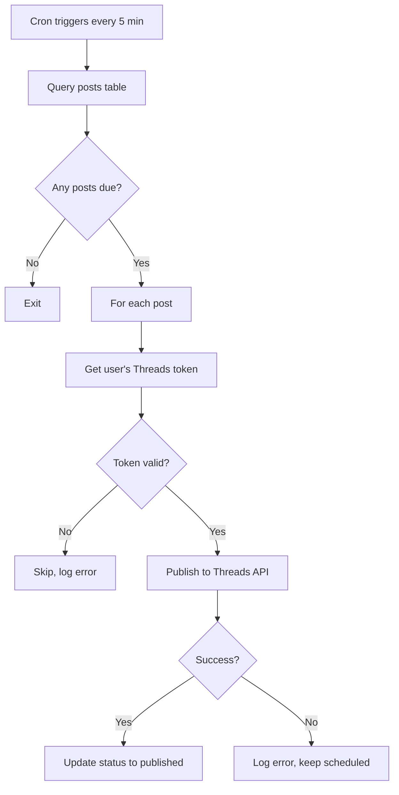
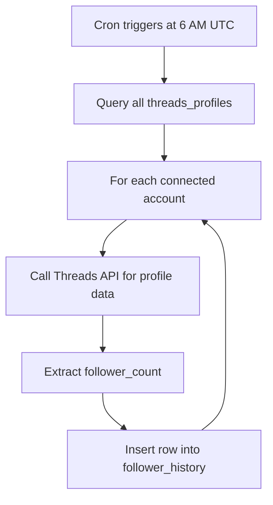

## Overview

Two edge functions run on cron schedules to automate background tasks. Both use the Supabase service role key to bypass RLS, since they operate across all users.

| Function | Schedule | Purpose |
|----------|----------|---------|
| auto-publish | Every 5 minutes | Publishes scheduled posts when they are due |
| sync-followers | Daily at 6:00 AM UTC | Records follower counts for all connected accounts |

## auto-publish

Checks for scheduled posts that are due and publishes them to Threads automatically.

**Cron name:** `auto-publish-scheduled-posts`

**Schedule:** `*/5 * * * *` (every 5 minutes)

### How it works



### Query logic

The function queries for posts where:

```sql
status = 'scheduled'
AND scheduled_date <= CURRENT_DATE
AND scheduled_time <= CURRENT_TIME
```

### Publishing process

For each matching post:

1. Look up the user's `threads_profiles` row for their access token
2. If the post belongs to a thread (`thread_id` is set), publish as a thread
3. If it is a standalone post, publish as a single post
4. On success, update `status` to `published`
5. On failure, log the error and leave the post as `scheduled` for the next cycle

### Error scenarios

| Scenario | Behavior |
|----------|----------|
| Expired Threads token | Post stays scheduled, error logged |
| Threads API rate limit | Post stays scheduled, retried next cycle |
| Invalid post content | Post stays scheduled, error logged |
| Network timeout | Post stays scheduled, retried next cycle |

<Callout kind="info">
  Posts that fail to publish are not removed from the queue. They remain in `scheduled` status and will be retried on the next 5-minute cycle. Check the function logs if a post is stuck.
</Callout>

## sync-followers

Records the current follower count for every connected Threads account. This data powers the follower growth chart on the dashboard.

**Cron name:** `sync-follower-counts`

**Schedule:** `0 6 * * *` (daily at 6:00 AM UTC)

### How it works



### Process

1. Query all rows from `threads_profiles`
2. For each user, call the Threads API to fetch current profile data
3. Extract the follower count from the response
4. Insert a new row into `follower_history` with the user ID, count, and current timestamp

### Data stored

Each sync creates one row per connected user in `follower_history`:

| Column | Value |
|--------|-------|
| user_id | The Supabase auth user ID |
| follower_count | Current follower count from Threads |
| recorded_at | Timestamp of the sync |

### Error handling

| Scenario | Behavior |
|----------|----------|
| Expired token for a user | That user is skipped, others continue |
| Threads API down | Function fails, retried next day |
| No connected accounts | Function exits cleanly |

<Callout kind="tip">
  The follower history table grows by one row per user per day. For a small user base this is negligible, but consider adding a retention policy if the table grows large.
</Callout>

## Monitoring cron jobs

Check whether cron jobs are running:

```bash
# View auto-publish logs
supabase functions logs auto-publish --tail

# View sync-followers logs
supabase functions logs sync-followers --tail
```

You can also check the Supabase dashboard under **Database > Extensions > pg_cron** to see job execution history and status.
