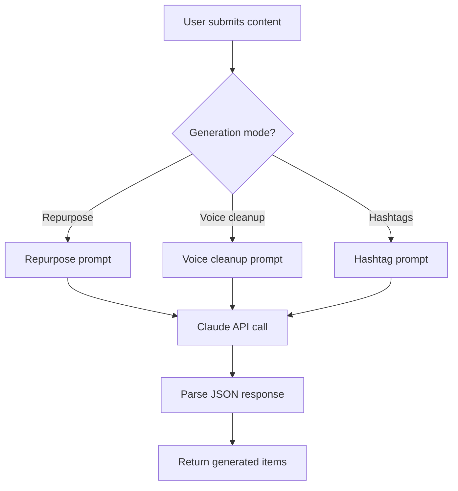

## generate-threads

AI-powered content generation using the Claude API (Haiku model). Transforms source content into Threads-ready posts and threads.

**Endpoint:** `POST /functions/v1/generate-threads`

**Auth:** User JWT in Authorization header

### How it works



### Request

<ParamField header="Authorization" param-type="string" required="true" deprecated="false">
  Bearer token with the user's Supabase JWT. Format: `Bearer eyJ...`
</ParamField>

<ParamField body="content" param-type="string" required="true" deprecated="false">
  The source content to generate from. Can be pasted text, a transcript, or content extracted via fetch-url-content.
</ParamField>

<ParamField body="mode" param-type="string" required="true" deprecated="false">
  Generation mode. One of: `repurpose`, `voice`, `hashtags`.
</ParamField>

### Generation modes

<Tabs>
  <Tab title="Repurpose" icon="repeat">
    Transforms content into a mix of standalone posts and multi-post threads.

    **System prompt:**
    ```text
    You are a social media content expert. Repurpose content into a mix of
    standalone posts and threads. Return JSON with items array containing
    type post/thread with content_type and pillar.
    ```

    **Response format:**
    ```json
    {
      "items": [
        {
          "type": "post",
          "content": "Single post text...",
          "content_type": "educational",
          "pillar": "visibility"
        },
        {
          "type": "thread",
          "content": ["Post 1...", "Post 2...", "Post 3..."],
          "content_type": "storytelling",
          "pillar": "authority"
        }
      ]
    }
    ```
  </Tab>

  <Tab title="Voice cleanup" icon="mic">
    Cleans up transcripts by removing filler words while preserving the speaker's voice.

    **System prompt:**
    ```text
    Clean up transcript, remove filler words
    ```

    Removes: um, uh, like, you know, repetitions, false starts, and incomplete sentences.
  </Tab>

  <Tab title="Hashtags" icon="hash">
    Generates 5 to 8 relevant hashtags for a given post.

    **System prompt:**
    ```text
    Generate 5-8 relevant hashtags. Return ONLY a JSON array of hashtag strings.
    ```

    **Response format:**
    ```json
    ["#contentcreation", "#threadsapp", "#socialmedia", "#marketing", "#strategy"]
    ```
  </Tab>
</Tabs>

### Response

<Response show-lines="true" tabs="200 Success,500 Error">
  ```json
  {
    "items": [
      {
        "type": "post",
        "content": "Your systems should work harder than you do.",
        "content_type": "educational",
        "pillar": "operations"
      }
    ]
  }
  ```

  ```json
  {
    "error": "Failed to generate content",
    "details": "Claude API rate limit exceeded"
  }
  ```
</Response>

### Error handling

| Status | Cause | Resolution |
|--------|-------|------------|
| 401 | Missing or invalid JWT | Ensure the user is logged in |
| 429 | Claude API rate limited | Wait and retry |
| 500 | Invalid API key or Claude error | Check ANTHROPIC_API_KEY secret |
| 504 | Function timeout | Reduce content length or retry |

## fetch-url-content

Fetches and extracts text content from a URL. Used to pull in web content for AI repurposing.

**Endpoint:** `POST /functions/v1/fetch-url-content`

**Auth:** User JWT in Authorization header

### Request

<ParamField header="Authorization" param-type="string" required="true" deprecated="false">
  Bearer token with the user's Supabase JWT.
</ParamField>

<ParamField body="url" param-type="string" required="true" deprecated="false">
  The URL to fetch and extract text from. Must be a valid HTTP or HTTPS URL.
</ParamField>

### Response

<Response show-lines="true" tabs="200 Success,400 Error">
  ```json
  {
    "title": "Page Title",
    "content": "Extracted text content from the page...",
    "source_url": "https://example.com/article"
  }
  ```

  ```json
  {
    "error": "Failed to fetch URL",
    "details": "URL returned 404"
  }
  ```
</Response>

### Typical workflow

1. User pastes a URL in the app
2. App calls `fetch-url-content` to extract the text
3. Extracted text is passed to `generate-threads` for AI repurposing
4. User reviews and saves the generated content

<Callout kind="tip">
  This function works best with article pages and blog posts. Pages that rely heavily on JavaScript rendering may return incomplete content.
</Callout>
