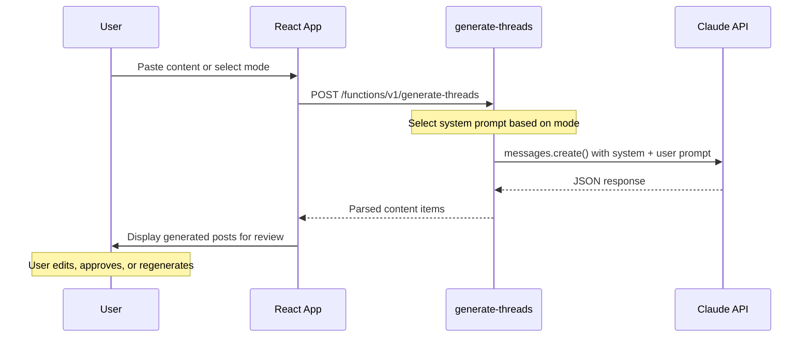

## Overview

Threadflow uses the Anthropic Claude API for AI-powered content generation. All AI requests route through the `generate-threads` edge function. The frontend never calls the Claude API directly.

**Model:** `claude-3-haiku-20240307`

The Anthropic API key is stored as a Supabase secret (`ANTHROPIC_API_KEY`) and rotated every 90 days.

## Content generation modes

The `generate-threads` function supports three generation modes, each with a different system prompt.

### 1. Repurpose content

Transforms existing content (blog posts, transcripts, articles) into Threads-ready posts and threads.

```text
System prompt:
"You are a social media content expert. Repurpose content into a mix of
standalone posts and threads. Return JSON with items array containing
type post/thread with content_type and pillar."
```

**Input:** Source content (pasted text or extracted from URL via `fetch-url-content`)

**Output:** JSON array of generated posts:

```json
{
  "items": [
    {
      "type": "post",
      "content": "Generated post text...",
      "content_type": "educational",
      "pillar": "visibility"
    },
    {
      "type": "thread",
      "content": ["Thread post 1...", "Thread post 2...", "Thread post 3..."],
      "content_type": "storytelling",
      "pillar": "authority"
    }
  ]
}
```

### 2. Voice cleanup

Takes raw transcript or voice memo content and cleans it up for publishing.

```text
System prompt:
"Clean up transcript, remove filler words"
```

This mode preserves the speaker's original voice and intent while removing:
- Filler words (um, uh, like, you know)
- Repetitions and false starts
- Incomplete sentences

### 3. Hashtag generation

Generates relevant hashtags for a given post.

```text
System prompt:
"Generate 5-8 relevant hashtags. Return ONLY a JSON array of hashtag strings."
```

**Output:**

```json
["#contentcreation", "#threadsapp", "#socialmedia", "#digitalmarketing", "#contentstrategy"]
```

## Recommendation engine

Post recommendations (best day, best time, optimal length) are **not** AI-generated. They are computed server-side from actual engagement data stored in the database.

The engine analyzes:
- Historical post performance by day of week
- Engagement rates by time of day
- Correlation between post length and engagement metrics

## How the generation flow works



## Error handling

The edge function handles these Claude API failure cases:

| Scenario | Behavior |
|----------|----------|
| Invalid API key | Returns 500 with auth error message |
| Rate limited | Returns 429 with retry guidance |
| Malformed JSON response | Attempts to parse, falls back to raw text |
| Timeout | Returns 504 after Supabase function timeout |

## Configuration

| Secret | Value | Rotation |
|--------|-------|----------|
| `ANTHROPIC_API_KEY` | Anthropic API key | Every 90 days |

<Callout kind="info">
  The Haiku model was chosen for its speed and cost efficiency. Content generation requests typically complete in 1 to 3 seconds.
</Callout>
