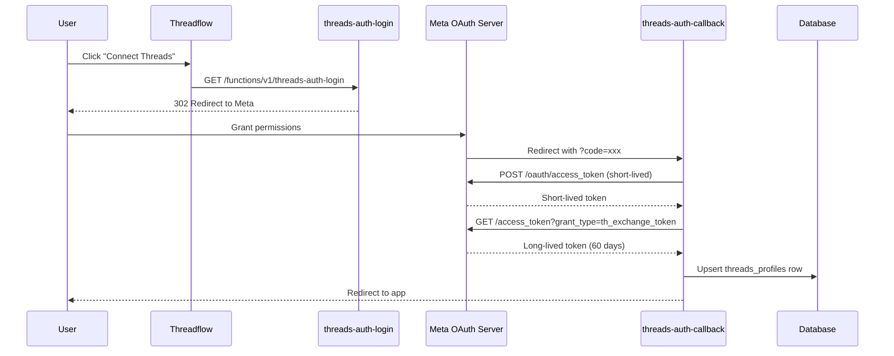
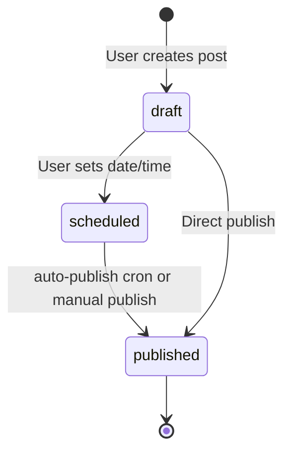

## Overview

Threadflow integrates with the Threads API for five core capabilities:

1. **OAuth authentication** to connect user accounts
2. **Publishing** posts and threads directly to Threads
3. **Insights** to fetch engagement metrics on published posts
4. **Mentions** to track when users are mentioned
5. **Replies** to fetch conversation threads

All Threads API communication happens through Supabase Edge Functions. The frontend never calls the Threads API directly.

## OAuth flow

Threadflow uses Meta's OAuth 2.0 flow to connect Threads accounts. Two edge functions handle this:

- `threads-auth-login` initiates the flow
- `threads-auth-callback` completes it

### Required scopes

The OAuth request includes these Threads API scopes:

- `threads_basic` - Read profile information
- `threads_content_publish` - Publish posts
- `threads_read_replies` - Read replies to posts
- `threads_manage_insights` - Access engagement metrics
- `threads_manage_replies` - Manage reply interactions

### Token lifecycle

| Token type | Duration | Storage |
|------------|----------|---------|
| Short-lived | ~1 hour | Never stored, exchanged immediately |
| Long-lived | 60 days | Encrypted in `threads_profiles.access_token` |

<Callout kind="alert">
  Long-lived tokens expire after 60 days. When a user reconnects their Threads account, the callback function automatically exchanges for a fresh long-lived token.
</Callout>

## Publishing

The `threads-publish` edge function handles posting to Threads. It supports both single posts and multi-post threads.

### Single post flow

1. Create a media container via `POST /threads` with the post text
2. Wait for container to process
3. Publish the container via `POST /threads_publish`

### Thread (multi-post) flow

1. Create a media container for each post in the thread
2. Create a carousel container referencing all child containers
3. Publish the carousel container

### Post status lifecycle

## Insights

The `threads-insights` function fetches engagement metrics for published posts.

Available metrics from the Threads API:

| Metric | Description |
|--------|-------------|
| views | Number of times the post was viewed |
| likes | Number of likes |
| replies | Number of replies |
| reposts | Number of reposts |
| quotes | Number of quote posts |

These metrics feed into Threadflow's recommendation engine, which calculates:
- Best day of week to post
- Best time of day to post
- Optimal post length based on engagement

## Mentions

The `threads-mentions` function fetches posts where the user is mentioned. Events also arrive in real time via the Threads webhook.

## Replies

The `threads-replies` function retrieves reply threads on the user's posts, enabling conversation tracking without leaving Threadflow.

## Disconnecting

The `threads-disconnect` function removes a user's Threads connection by deleting their `threads_profiles` row. This revokes the stored token.

## Configuration

All Threads API credentials are stored as Supabase secrets:

| Secret | Purpose |
|--------|---------|
| `THREADS_APP_ID` | Meta App ID |
| `THREADS_APP_SECRET` | Meta App Secret |
| `THREADS_REDIRECT_URI` | OAuth callback URL |

See [API Key Rotation](/security/api-key-rotation) for the rotation schedule.
