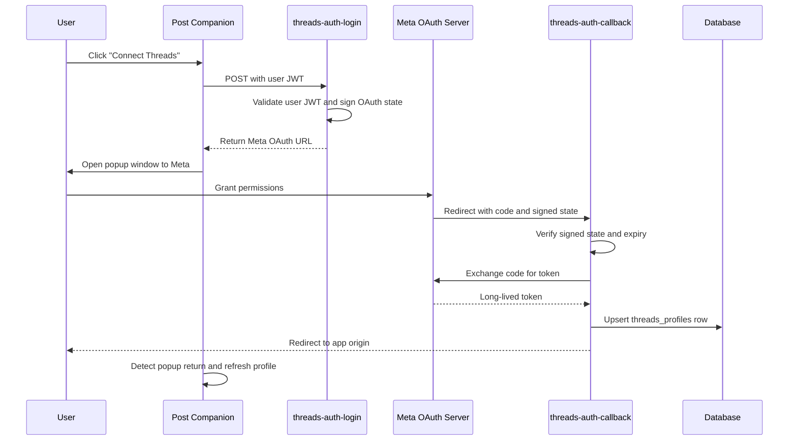
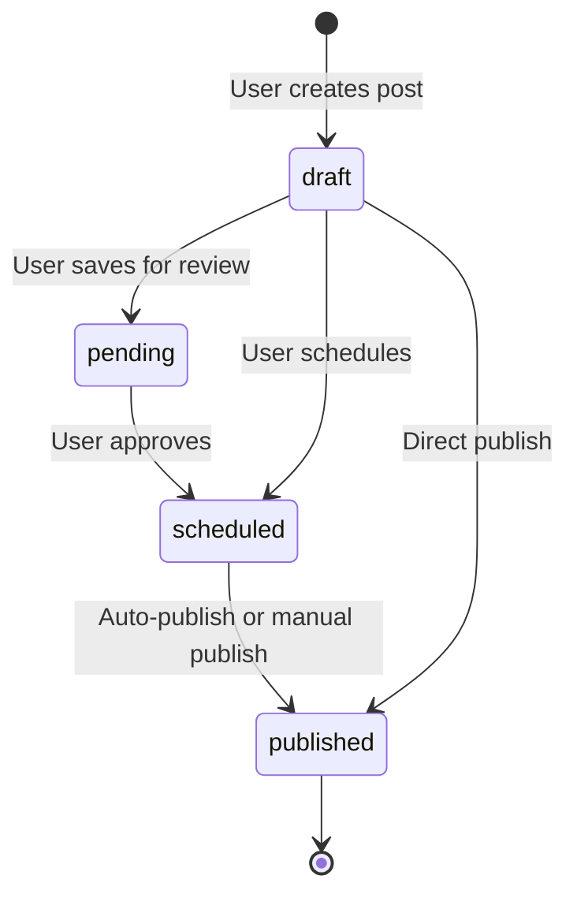

## Overview

Post Companion integrates with the Threads API for five core capabilities:

1. **OAuth authentication** to connect user accounts
2. **Publishing** posts and threads directly to Threads
3. **Insights** to fetch engagement metrics on published posts
4. **Mentions** to track when users are mentioned
5. **Replies** to fetch conversation threads

All Threads API communication happens through Supabase Edge Functions. The frontend never calls the Threads API directly.

## OAuth flow

Post Companion uses Meta's OAuth 2.0 flow to connect Threads accounts. The flow opens in a popup window so users stay in the current page.

Two edge functions handle it:

- `threads-auth-login` starts the flow and returns the Meta OAuth URL
- `threads-auth-callback` completes the flow, exchanges the code for a long-lived token, and stores the profile


```mermaid
sequenceDiagram
    participant User
    participant App as Post Companion
    participant Login as threads-auth-login
    participant Meta as Meta OAuth Server
    participant Callback as threads-auth-callback
    participant DB as Database

    User->>App: Click "Connect Threads"
    App->>Login: POST with user JWT
    Login->>Login: Validate user JWT and sign OAuth state
    Login-->>App: Return Meta OAuth URL
    App->>User: Open popup window to Meta
    User->>Meta: Grant permissions
    Meta->>Callback: Redirect with code and signed state
    Callback->>Callback: Verify signed state and expiry
    Callback->>Meta: Exchange code for token
    Meta-->>Callback: Long-lived token
    Callback->>DB: Upsert threads_profiles row
    Callback-->>User: Redirect to app origin
    App->>App: Detect popup return and refresh profile
```

### OAuth gateway configuration

Meta calls `threads-auth-callback` directly, so that callback cannot include a Supabase user auth header. The OAuth functions are configured with Supabase gateway JWT verification disabled, then they apply their own checks inside the function.

```toml
[functions.threads-auth-login]
verify_jwt = false

[functions.threads-auth-callback]
verify_jwt = false
```

This is intentional:

- `threads-auth-login` still validates the signed-in user with the Authorization header inside the function
- `threads-auth-callback` validates the signed OAuth `state`, including signature and expiry
- The callback stores data only for the user ID embedded in the verified state

<Callout kind="info">
  The app domain `https://app.postcompanion.app` is an allowed OAuth redirect origin. Local development origins are also supported.
</Callout>

### Required scopes

The OAuth request includes these Threads API scopes:

- `threads_basic` to read profile information
- `threads_content_publish` to publish posts
- `threads_read_replies` to read replies to posts
- `threads_manage_insights` to access engagement metrics
- `threads_manage_replies` to manage reply interactions

## Multi-account support

Users can connect more than one Threads account.

| Plan | Connected Threads accounts |
|------|----------------------------|
| Free | 1 |
| Pro | 3 |
| Team | 10 |

Each connected account has a row in the `threads_profiles` table with an `is_active` flag.

### Switching accounts

The `threads-switch-account` edge function sets `is_active = true` for the chosen account and `is_active = false` for all others owned by that user.

All account-specific data uses `threads_user_id` so each profile stays separate.

Profile-scoped data includes:

- Posts and scheduled content
- Content Bank drafts and pending review items
- Categories and content types
- Inspiration
- Brand voice, goals, templates, writing samples, and custom prompts
- Follower history, analytics, and dashboard metrics
- Webhook secrets

## Publishing

The `threads-publish` edge function handles posting to Threads. It supports both single posts and multi-post threads.

### Post status lifecycle


```mermaid
stateDiagram-v2
    [*] --> draft: User creates post
    draft --> pending: User saves for review
    pending --> scheduled: User approves
    draft --> scheduled: User schedules
    scheduled --> published: Auto-publish or manual publish
    draft --> published: Direct publish
    published --> [*]
```

## Insights, mentions, and replies

The Threads integration also powers:

| Function | Purpose |
|----------|---------|
| `threads-insights` | Fetches views, likes, replies, reposts, and quote metrics |
| `threads-mentions` | Fetches posts where the user is mentioned |
| `threads-replies` | Fetches reply threads on the user's posts |
| `threads-webhook` | Receives real-time Meta webhook events |

## Disconnecting

The `threads-disconnect` function removes a Threads account by deleting its `threads_profiles` row. If the disconnected account was active, the next account in the list becomes active automatically.

## Configuration

All Threads API credentials are stored as Supabase secrets:

| Secret | Purpose |
|--------|---------|
| `THREADS_APP_ID` | Meta App ID |
| `THREADS_APP_SECRET` | Meta App Secret |
| `THREADS_OAUTH_STATE_SECRET` | HMAC secret for signed OAuth state |
| `ALLOWED_REDIRECT_ORIGINS` | Optional comma-separated allowed app origins |
| `APP_ORIGIN` | Optional fallback app origin |

The OAuth callback URL uses the Supabase functions domain:

```text
https://xaoodbhmrkpcweedvoev.supabase.co/functions/v1/threads-auth-callback
```

See [API Key Rotation](/security/api-key-rotation) for the rotation schedule.
