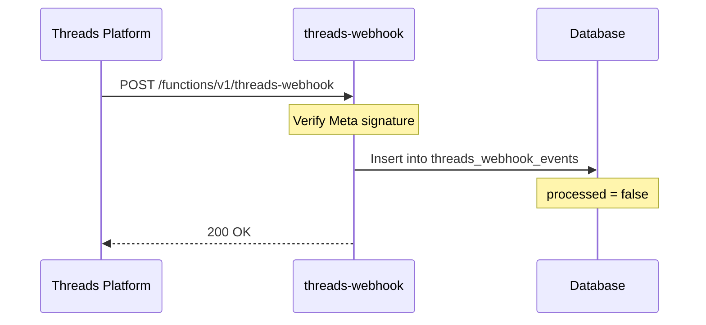

## Overview

The `threads-webhook` edge function receives real-time events from the Threads platform. When something happens on Threads (a mention, a post publish confirmation), Meta sends an HTTP POST to this endpoint.

**Endpoint:** `https://xaoodbhmrkpcweedvoev.supabase.co/functions/v1/threads-webhook`

## Supported event types

| Event type | Description | Trigger |
|------------|-------------|---------|
| `mentions` | Someone mentioned the user in a Threads post | Real-time |
| `publish` | A post was successfully published | After publish completes |

## How it works



## Webhook verification

Meta sends a verification challenge when you first register the webhook URL. The function must respond with the challenge value.

### Verification request (GET)

Meta sends a GET request with these query parameters:

<ParamField query="hub.mode" param-type="string" required="true" deprecated="false">
  Always `subscribe` for webhook verification.
</ParamField>

<ParamField query="hub.challenge" param-type="string" required="true" deprecated="false">
  A random string that must be returned in the response body.
</ParamField>

<ParamField query="hub.verify_token" param-type="string" required="true" deprecated="false">
  The verify token you configured in the Meta App dashboard.
</ParamField>

The function validates the verify token and returns the challenge string as plain text.

### Event delivery (POST)

After verification, Meta sends POST requests for each event.

<ParamField header="X-Hub-Signature-256" param-type="string" required="true" deprecated="false">
  HMAC-SHA256 signature of the request body using the App Secret. Used to verify the request is genuinely from Meta.
</ParamField>

<ParamField body="object" param-type="string" required="true" deprecated="false">
  Always `threads` for Threads webhook events.
</ParamField>

<ParamField body="entry" param-type="array" required="true" deprecated="false">
  Array of event entries, each containing event data.
</ParamField>

## Event payload example

```json
{
  "object": "threads",
  "entry": [
    {
      "id": "123456789",
      "time": 1704067200,
      "changes": [
        {
          "field": "mentions",
          "value": {
            "media_id": "987654321",
            "text": "@yourhandle great post!"
          }
        }
      ]
    }
  ]
}
```

## Data storage

All incoming events are stored in the `threads_webhook_events` table:

| Column | Description |
|--------|-------------|
| event_type | `mentions` or `publish` |
| threads_user_id | The Threads user ID this event relates to |
| object_id | The Threads object (post, comment) ID |
| payload | Full JSON payload from Meta |
| processed | Boolean flag for processing status |

Events are stored with `processed = false` and can be processed by application logic as needed.

## Setting up the webhook in Meta

<Steps>
  <Step title="Open Meta App Dashboard" icon="external-link" title-type="p">
    Go to [developers.facebook.com](https://developers.facebook.com) and open your Threads app.
  </Step>

  <Step title="Configure the webhook URL" icon="link" title-type="p">
    In the Webhooks section, set the callback URL to:

    ```text
    https://xaoodbhmrkpcweedvoev.supabase.co/functions/v1/threads-webhook
    ```
  </Step>

  <Step title="Set the verify token" icon="key" title-type="p">
    Enter a verify token that matches what your edge function expects.
  </Step>

  <Step title="Subscribe to fields" icon="check" title-type="p">
    Subscribe to the `mentions` and `publish` fields.
  </Step>

  <Step title="Verify the subscription" icon="check-circle" title-type="p">
    Meta will send a GET request to verify the endpoint. Check the function logs to confirm it responded correctly.
  </Step>
</Steps>

<Callout kind="tip">
  Use `supabase functions logs threads-webhook` to debug webhook delivery issues. Meta retries failed deliveries, so you may see duplicate events.
</Callout>
